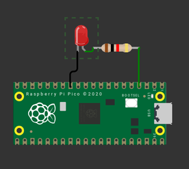

# Atividade #3 - Escrita serial

Lorem ipsum dolor sit amet, consectetur adipiscing elit. Nunc vel nunc pretium,
volutpat dolor eu, dignissim sem. Vivamus nunc leo, viverra nec mollis vel,
imperdiet id erat. Nam venenatis neque non ante dignissim porta. Fusce blandit
nulla id dui tristique auctor. Etiam ac mi interdum, sagittis mi ac, luctus
nisl. Proin nec orci augue. Donec nec iaculis ex, ac efficitur ipsum.

## Diagrama



[Abrir no Wokwi](https://wokwi.com/projects/382395689125209089)

## Tarefa

Modifique o código `main.c` para fazer o LED acender e apagar trocando o estado
a cada `250ms` (ele vai piscar!).

> [!TIP]
> Indicamos para vocês testarem primeiro online no wokwi e depois validam no CI.

## Código

Para configurar um pino como saída use:

```c
gpio_init(LED_PIN);
gpio_set_dir(LED_PIN, GPIO_OUT);
```

E para controlar o pino use:

```c
gpio_put(LED_PIN, 1); // para ativar
gpio_put(LED_PIN, 0); // para desativar
```

> [!IMPORTANT]
> não esqueçca de definir o valor do `LED_PIN` no cabeçalho do seu código!

### Cenário de teste

O teste verifica se o LED começa apagado e se acende depois de `250ms`
